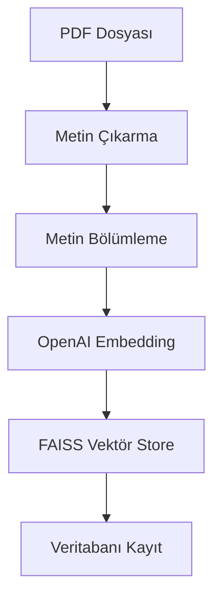

# animaldiseasechatbot# 🤖 Hayvan Hastalıkları Chatbot

Bu proje, PDF dosyalarından bilgi çıkararak hayvan hastalıkları hakkında sorulara yanıt verebilen bir yapay zeka chatbot uygulamasıdır.

## 🌟 Özellikler

### 1. PDF İşleme ve Metin Çıkarma
- PDF dosyalarını yükleme ve metin çıkarma
- Metin bölümleme (chunking) ile büyük metinleri yönetilebilir parçalara ayırma
- Akıllı metin bölümleme stratejisi (1000 karakter chunk boyutu, 200 karakter örtüşme)

### 2. Gelişmiş NLP ve Embedding
- OpenAI embeddings kullanarak metin vektörleştirilmesi
- FAISS (Facebook AI Similarity Search) ile verimli vektör araması
- Mistral AI entegrasyonu ile güçlü doğal dil işleme

### 3. Veritabanı Entegrasyonu
- SQL Server veritabanı ile kalıcı veri depolama
- Konuya dayalı veri organizasyonu
- Vektör ve metin verilerinin verimli depolanması

### 4. Kullanıcı Arayüzü
- Streamlit ile kullanıcı dostu web arayüzü
- PDF yükleme ve konu seçimi özellikleri
- Gerçek zamanlı soru-cevap etkileşimi

## 🔧 Teknik Mimari

### Embedding İşlemi


### Soru-Cevap Akışı
1. Kullanıcı soru sorar
2. Vektör veritabanında benzer içerikler aranır
3. Mistral AI ile cevap oluşturulur
4. Konuşma geçmişi saklanır

## 💾 Veritabanı Yapısı

### Tablolar:
1. **TOPICS**
   - TopicID (PK)
   - TopicName

2. **PDF**
   - DocumentID (PK)
   - TopicID (FK)
   - DocumentData
   - DocumentName

3. **PDFChunks**
   - ChunkID (PK)
   - DocumentID (FK)
   - ChunkText
   - VectorData

## 🚀 Önemli Bileşenler

### 1. Metin İşleme
```python
text_splitter = CharacterTextSplitter(
    separator="\n",
    chunk_size=1000,
    chunk_overlap=200,
    length_function=len
)
```

### 2. Embedding ve Vektör Depolama
- OpenAI embeddings ile metin vektörleştirilmesi
- FAISS ile yüksek boyutlu vektör indexleme
- Verimli benzerlik araması

### 3. Sohbet Zinciri
- ConversationBufferMemory ile konuşma geçmişi takibi
- Mistral AI ile doğal dil anlama ve üretme
- Bağlamsal cevap oluşturma

## 🔍 Çalışma Prensibi

1. **Veri Hazırlama**
   - PDF yükleme ve metin çıkarma
   - Metin bölümleme ve embedding
   - Veritabanına kaydetme

2. **Soru-Cevap**
   - Kullanıcı sorusu embedding'e dönüştürülür
   - FAISS ile en alakalı metin parçaları bulunur
   - Mistral AI ile cevap oluşturulur

3. **Veritabanı Entegrasyonu**
   - Konuya göre verilerin organize edilmesi
   - Vektör ve metin verilerinin saklanması
   - Hızlı erişim ve arama

## 📚 Kullanılan Teknolojiler

- **PyODBC**: SQL Server bağlantısı
- **Streamlit**: Web arayüzü
- **PyPDF2**: PDF işleme
- **LangChain**: NLP işlemleri
- **OpenAI**: Metin embedding
- **FAISS**: Vektör araması
- **Mistral AI**: Doğal dil işleme
- **NumPy**: Vektör işlemleri

## 🔄 İş Akışı

1. PDF yükleme ve konu seçimi
2. Metin çıkarma ve bölümleme
3. Embedding oluşturma
4. Veritabanına kaydetme
5. Soru-cevap etkileşimi
